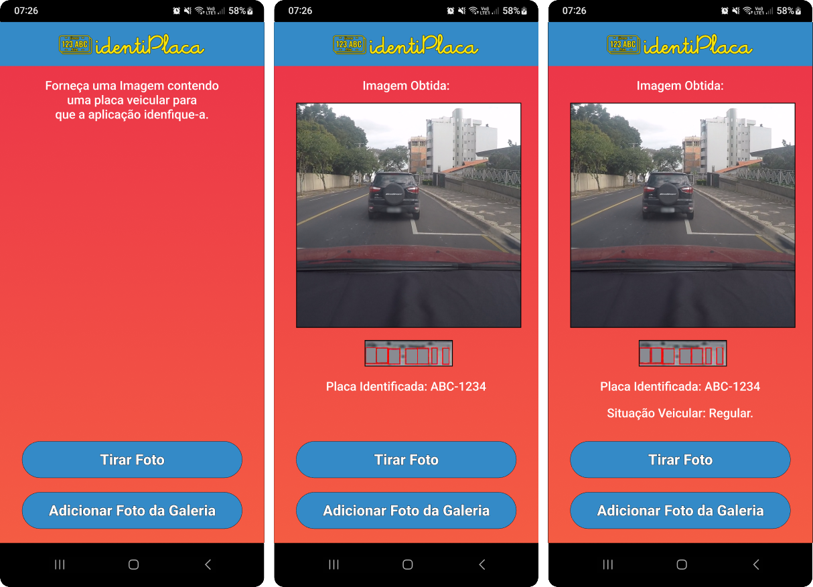

# Desenvolvimento de um Sistema Móvel de Reconhecimento de Placas De Veículos Baseado em Redes Neurais Artificiais

Aplicação desenvolvida para a plataforma Android, capaz de analisar imagens contendo veículos para identificar suas placas veiculares utilizando Redes Neurais Artificiais.

<b>Título do Projeto:</b>  Desenvolvimento de um Sistema Móvel de Reconhecimento de Placas De Veículos Baseado em Redes Neurais Artificiais

<b>Contexto:</b> Este app foi construído no âmbito da disciplina de Projeto Final de Curso 2 (PFC 2), visando apresentar à banca examinadora, uma aplicação completa para dispostivos Android, capaz de identificar os caracteres de uma placa veicular dado uma imagem contendo um ou mais veículos com placas veiculares completamente visíveis.

<b>Organização dos arquivos: </b>

- <b>preparando_dataset:</b> os arquivos relativos aos códigos utilizados para preparar os rótulos e imagens para serem utilizados junto com o Yolo estão nesta pasta. Os arquivos foram divididos de acordo com o modelo treinado. Por exemplo, em "placas", há os códigos para preparar e testar as imagens e labels referentes ao modelo de reconhecimento de placas.

- <b>avaliando_modelos:</b> os arquivos relativos à análise das performances obtidas pelo modelos estão neste diretório. Assim como o diretório anterior, os códigos foram separados por modelo e por abordagem.

- <b>aplicacao_android:</b> este diretório contém os arquivos pertinentes ao desenvolvimento da aplicação android, como os arquivos xml utilizados para organizar e estilizar os elementos pertinentes à interface gráfica, as imagens utilizadas, dentre outros arquivos. Obs.: Esta pasta é o projeto construído no Android Studio, podendo ser aberta por esta aplicação para navegar entre os códigos desenvolvidos.

<b>Interface Gráfica:</b>

Autor: Elton Soares Silva